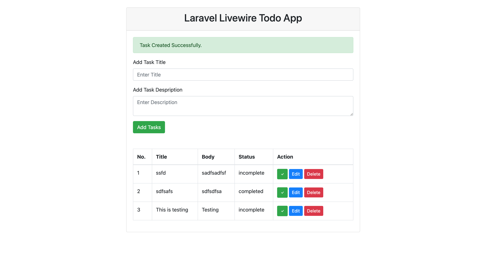

# Livewire TODO




A simple TODO list app built with Laravel Livewire. The main objective of this project is to provide an example application for those who are starting with Laravel Livewire.

- Create tasks.
- Edit tasks.
- Delete tasks.
- Complete tasks.
- Restore tasks.

### Tech

Technologies used in this project:

* [Laravel](https://github.com/laravel/laravel) - The Laravel PHP framework.
* [Livewire](https://github.com/livewire/livewire) - Laravel Livewire.
* [Bootstrap](https://github.com/twbs/bootstrap) - Bootstrap.

### Installation

Install the dependencies and devDependencies:

```sh
$ cd laravel-restaurant
$ composer install
```

Create your .env file and generate the application key:

```sh
$ cp .env.example .env
$ php artisan key:generate
```

Run migrations and start the server:

```sh
$ php artisan migrate
$ php artisan serve
```

### Development

Want to contribute? Great!
Feel free!

License
----

MIT
